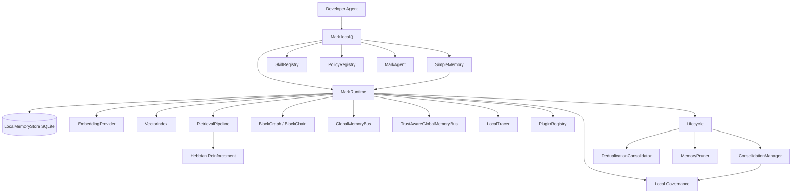
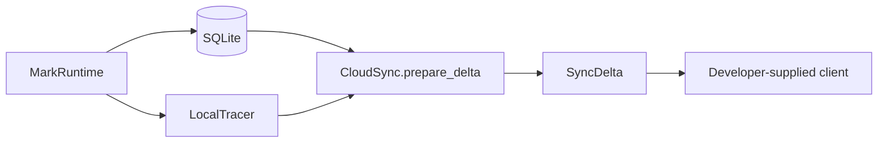
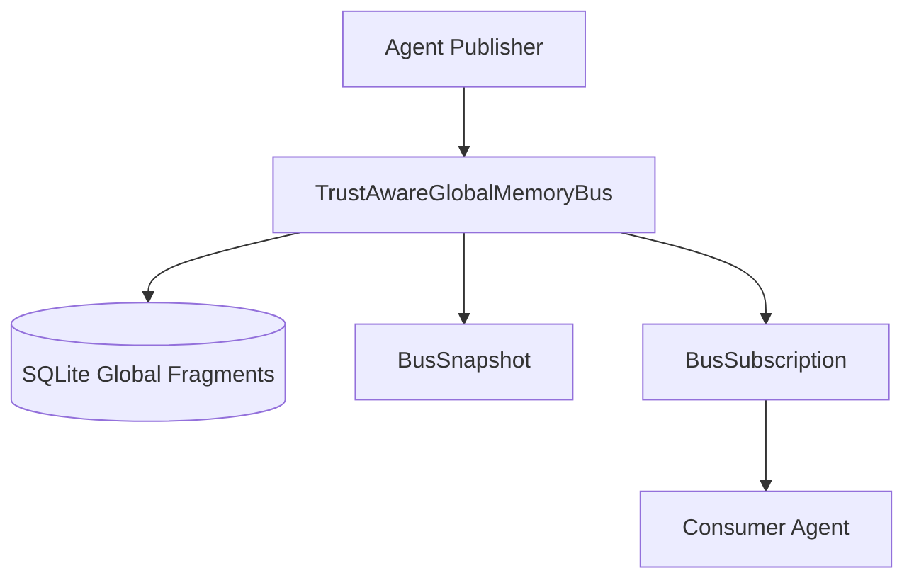

# MARK Python SDK Architecture

The MARK Python SDK is a local-first agent memory runtime. It is the open,
Apache-2.0-licensed layer that helps agents remember what they create, decide,
observe, and learn across long-running workflows.

MARK is more than a memory store. It combines storage, retrieval, context
injection, automatic observation, structured memory graphs, provenance, and
framework adapters so memory can participate in the agent execution loop.

Everything documented here runs locally. Any remote behavior must enter through
public SDK hooks or developer-supplied clients; service-side design is out of
scope for this document.

Framework adapters in `mark.adapters` are optional compatibility shims over
public MARK APIs. They may expose MARK to LangChain, MCP, or similar runtimes,
but they must not move remote transport, account infrastructure, or
framework-specific product logic into the local SDK core.

## Design Goals

MARK is designed around four practical goals:

- **Creation memory:** preserve continuity for stories, characters, scenes,
  images, videos, generated artifacts, code, plans, and decisions.
- **Runtime integration:** add memory to existing agents through wrappers,
  middleware, tools, or MCP rather than forcing a new application architecture.
- **Structured recall:** organize memory as fragments, nodes, edges, sessions,
  and blocks instead of treating memory as a flat vector collection.
- **Trust and provenance:** inspect, seal, verify, and quarantine memory so
  autonomous and multi-agent workflows can reason about where context came
  from.

## Entrypoints

### `Mark.local()`

`Mark.local()` is the public entrypoint for local use cases.

It is designed for:

- tutorials and quick scripts,
- lightweight coding agents,
- local project memory,
- SQLite persistence in `.mark/memory.db`,
- direct use as a tool, middleware helper, or agent wrapper.

It wires:

- `MarkRuntime.local()` as the runtime engine,
- `SimpleMemory` as the ergonomic block/retrieve surface,
- `ContextBuilder`,
- `PolicyRegistry`,
- `SkillRegistry`,
- `MarkAgent`.

```python
from mark import Mark

with Mark.local(".") as mark:
    mark.memory.block("project").write("The API framework is FastAPI.")
    print(mark.memory.retrieve("Which API framework?").as_text())
```

Advanced path:

```python
with Mark.local(".") as mark:
    agent = mark.runtime.memory("coder")
    agent.store_sync("FastAPI handles routing.")
    mark.runtime.run_cycle("coder")          # consolidate + deduplicate + prune
    mark.runtime.integrity_check()           # []
```

### `MarkRuntime.local()`

`MarkRuntime.local()` is the explicit runtime engine. Most developers should
start with `Mark.local()`, but framework integrations and advanced
applications can use `MarkRuntime` directly.

It wires:

- `LocalMemoryStore` with SQLite,
- `HashEmbeddingProvider` or developer-provided `EmbeddingProvider`,
- `VectorIndex`,
- `RetrievalPipeline`,
- `PluginRegistry`,
- `MarkMemory`,
- `GlobalMemoryBus`,
- `TrustAwareGlobalMemoryBus`,
- `LocalTracer`,
- `GovernanceAuditLog`.

## Memory Model

```text
fragment  → atomic evidence (content, session, tags, importance, confidence)
node      → semantic anchor built from fragments (character, fact, location…)
edge      → directed, typed, weighted relation between nodes
block     → bounded set of fragments, nodes, and the edges between them
chain     → blocks sealed and linked forward/backward per agent
```

An agent owns a namespace. Sessions partition it (`session_id`,
`session_prefix`), tags narrow it, and blocks group it into inspectable units.

This model lets MARK represent both factual memory and creative/workflow
memory. A block can hold a character bible, a generated scene, a design
decision, a coding plan, a test result, or a complete handoff between agents.

### Memory Blocks And Provenance

Blocks are graph containers: a block can represent a topic within a session,
an entire session, or a world-bible scope.

- Node membership is many-to-many (`block_nodes`), so canonical entities are
  never duplicated across blocks.
- Edges may be scoped to a block; scoped edges only connect member nodes.
- Blocks connect to other blocks through directed `BlockLink`s and are
  traversable forward and backward, like nodes through edges.
- Sealing (`BlockChain.seal`) computes a deterministic SHA-256 content hash
  over immutable member fields and links the block to the previously sealed
  block (`prev_block_hash`), forming a local, tamper-evident hash chain.
- `verify()` pinpoints corrupted, missing, or injected members;
  `verify_chain()` checks the whole chain.
- Quarantining a block removes its members from retrieval and traversal
  without affecting any other block or the agent's function.
- Mutable plasticity fields (importance, access counts, edge weights) are
  excluded from hashes so reinforcement never breaks a seal.

## Lifecycle

| Method | Role |
|---|---|
| `working_memory(agent_id)` | TTL-bound short-term memory |
| `consolidate(agent_id)` | Governed working-memory promotion |
| `deduplicate(agent_id)` | Embedding cluster merge and provenance |
| `prune(agent_id)` | Decay, fragment pruning, edge dissolution |
| `run_cycle(agent_id)` | Consolidate, deduplicate, prune |
| `integrity_check()` | SQLite health check |

Retrieval is live. Each retrieved fragment is touched, access count increases,
importance can strengthen through Hebbian reinforcement, and co-retrieved graph
edges strengthen through co-activation. Promoted/permanent memories are exempt
from decay.

Consolidation is governed locally before promotion. `ConsolidationGate` redacts
common secrets/PII, blocks empty or low-confidence content, rejects failure
artifacts, and can reject exact duplicate hashes. `MarkRuntime` keeps an
in-process `GovernanceAuditLog`.

Deduplication is transparent and local. The SDK clusters stored embeddings,
keeps the highest-importance canonical fragment, records `merged_from_ids`,
and reattaches graph nodes from deleted duplicates to the kept fragment.

## Retrieval And Context Injection

MARK's retrieval path is intentionally layered:

```text
query
  ↓
session / tag / block filters
  ↓
local vector retrieval
  ↓
graph expansion and scoring
  ↓
gap reporting
  ↓
optional query expansion / contextual compression
  ↓
agent context, tool result, or MCP response
```

Framework adapters use the same runtime APIs. Middleware retrieves relevant
memory before model calls and can archive reasoning or tool results after the
agent acts. Tools expose explicit recall/remember operations when the model
should decide when to use memory.

## Architecture Diagram



## Package Boundary

This package includes:

- memory data contracts,
- SQLite storage with schema versioning and in-place migrations,
- local retrieval, graph expansion, and gap reporting,
- graph-scoped memory blocks, block links, seal/verify, and quarantine,
- working memory, governed consolidation, deduplication, and pruning,
- graph nodes, edges, neighborhoods, and graph-connected context,
- session-aware retrieval and session activity logs,
- local governance heuristics and in-process audit logs,
- local observability events, session traces, and JSONL replay,
- local sync delta preparation with redaction,
- trust-aware global memory bus,
- plugin interfaces and hook constants,
- optional framework adapters and skills.

Managed infrastructure and service-side features are not part of this package.
The only paths from the SDK outward are `PluginRegistry` hooks and clients that
the developer explicitly supplies.

## Tool, Middleware, And Adapters

MARK can be used in three common ways:

- As a tool: the agent explicitly calls MARK retrieval.
- As middleware: MARK injects relevant memory before agent planning and records
  observations after tool/action results.
- As an MCP server: `mark.adapters.mcp` exposes local memory operations to any
  MCP-compatible client.

Framework adapters ship inside `mark-sdk` under `mark.adapters` with optional
dependency extras:

```text
mark/
  adapters/
    backend.py    MarkBackend protocol + LocalMarkBackend
    langchain/    tools + AgentMiddleware
    mcp/          MCP server factory
```

```bash
pip install "mark-sdk[langchain]"
pip install "mark-sdk[mcp]"
pip install "mark-sdk[adapters]"
pip install "mark-sdk[middleware]"
```

Adapter modules are thin framework glue over public MARK APIs. Adapter
namespaces without complete implementations are excluded from distributions
until they have real code and tests.

## Core Middleware

Framework-neutral middleware lives under `mark.middlewares`. It wraps public
runtime operations (`store`, `observe`, and `retrieve`) and lets adapters share
the same local behavior without reaching into private store or pipeline
internals.

Middleware is a battery layer: `pip install mark-sdk` gives the local memory
core, but none of these behaviors are active until a developer passes the
specific middleware into `Mark.local(..., middleware=[...])` or
`runtime.use(...)`. The `middleware` extra installs the full middleware bundle,
and named extras such as `middleware-governance`, `middleware-trust-bus`,
`middleware-sandbox`, and `middleware-media-continuity` provide per-battery
install targets.

```text
Agent / Framework
  ↓
Adapter middleware
  ↓
mark.middlewares.MiddlewareStack
  ↓
MarkMemory public operations
  ↓
MarkRuntime / RetrievalPipeline / CloudSync / LocalTracer
```

Initial local middleware includes:

- `RecallMiddleware`: default retrieval options such as compression, query
  expansion, session escalation, and explicit gap healing.
- `ObserveMiddleware`: default observation source, tags, and metadata.
- `CompressionMiddleware`: runtime compressor binding plus default retrieval
  compression.
- `QueryExpansionMiddleware`: runtime query-expander binding plus default
  expansion.
- `GapHealingMiddleware`: opt-in local gap healing and escalation.
- `GovernanceMiddleware`: explicit local governance gate metadata and
  quarantine behavior for rejected stores.
- `LifecycleMiddleware`: explicit local run-cycle triggers after writes.
- `ObservabilityMiddleware`: local tracer events around middleware operations.
- `SyncMiddleware`: redacted sync envelope preparation or caller-supplied
  client upload.
- `TrustBusMiddleware`: publish selected observations or writes to the local
  trust-aware bus.
- `SandboxMiddleware`: blocked-by-default local sandbox execution wrapper for
  explicit sandbox operations.
- `MediaContinuityMiddleware`: creative continuity defaults for observations
  and graph-expanded recall.

These classes automate local behavior only. Managed retrieval, governed
compression, browser healing, tenant policy, proof anchoring, remote sandbox
execution, and long-term observability retention remain outside the local SDK.

## Sync And Observability

The SDK can prepare local sync envelopes but does not implement any remote
transport. `CloudSync.prepare_delta()` returns a `SyncDelta` containing
redacted fragments, optional local events, options, and stats.
`CloudSync.sync()` forwards that envelope only when a caller supplies a client
object with `upload_delta(delta)`.



`LocalTracer` is available through `MarkRuntime.tracer()`, and
`MarkRuntime.session_trace(session_id)` provides a session-scoped view of
local events.

## Trust-Aware Bus

`TrustAwareGlobalMemoryBus` wraps `GlobalMemoryBus` with publisher trust,
subscriptions, snapshots, and trust-filtered retrieval. Messages persist as
global-bus fragments with trust tags and can be rehydrated when a runtime
reopens the same SQLite store.


